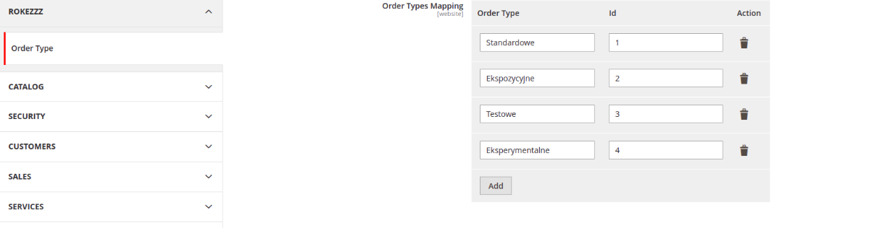
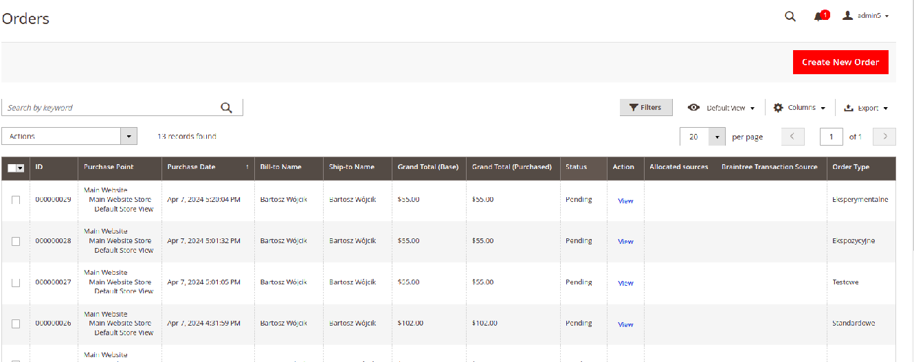
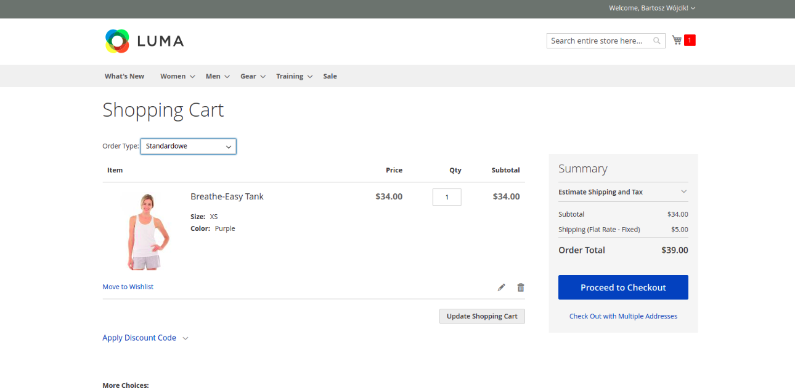

# Rokezzz_OrderType module

**Module Basic Information:** 
    - Configuration added `Stores > Configuration > Rokezzz > OrderType` with initial default values and enable/disable option
    with approtiate ACL

    - Column added to Orders Grid

    - Input option on Cart

    - order_type ID is saved on quote and order entity

## Database
`order_type` varchar column added to following tables:
    - sales_order
    - quote
    - sales_order_grid

### Layouts
`checkout_cart_index` layout extended

### UI components
 `view/adminhtml/ui_component` extended sales_order_grid for additional column.

For information about a UI component in Magento 2, see [Overview of UI components](https://devdocs.magento.com/guides/v2.4/ui_comp_guide/bk-ui_comps.html).

## Additional information

For information about significant changes in patch releases, see [Release information](https://devdocs.magento.com/guides/v2.4/release-notes/bk-release-notes.html).
